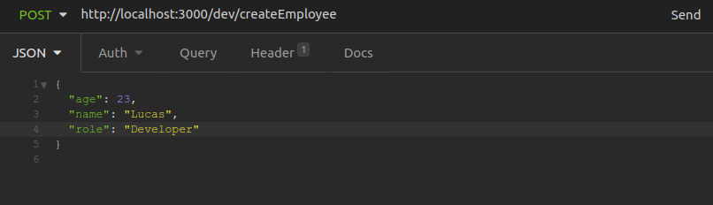
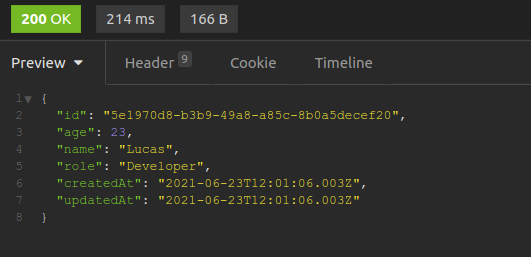
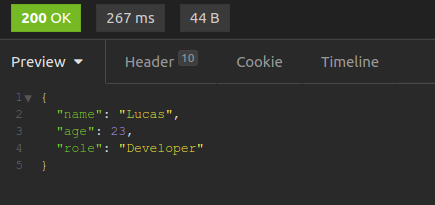
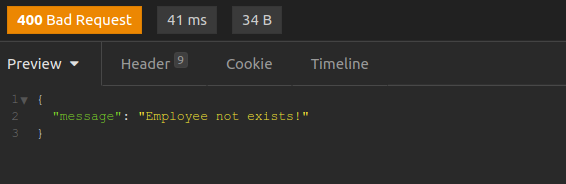
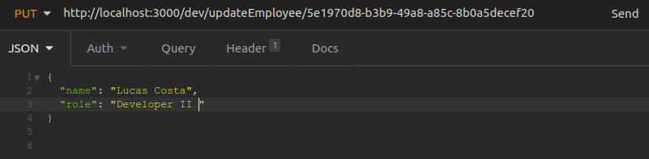
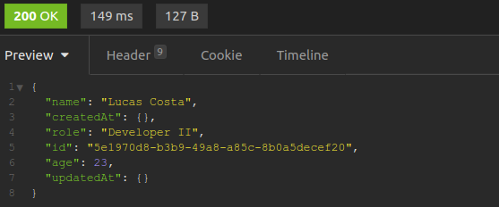
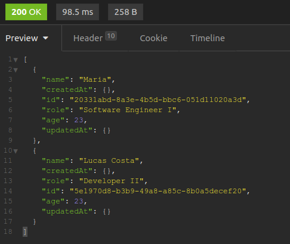
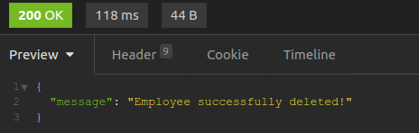

# Serverless API Challenge

## Requisitos

* [Node](https://nodes.org)
* [Serverless](https://www.serverless.com/framework/docs/getting-started/)
* [Yarn](https://yarnpkg.com/)

## Configurando a API
```bash
# Instalar as dependências
yarn install

# Instalar o DynamoDB
serverless dynamodb install

```

## Rodando a API e Banco de dados
```bash
# Executar a aplicação (http://localhost:3000)
yarn dev

# Executar o Banco de dados local (http://localhost:8000/shell)
yarn start:dynamo

```

## Acessando as rotas
----
```
POST   >>  http://localhost:3000/dev/createEmployee
```
### Request Body



### Response

* 200
<br>
----
```
GET    >>  http://localhost:3000/dev/getEmployee/{id}
```
### Responses

* 200
<br>

* 400
<br>
----
```
PUT    >>  http://localhost:3000/dev/updateEmployee/{id}
```
Aqui você poderá alterar um, dois ou todos atributos:

### Request Body



### Responses

* 200
<br>

* 400
<br>
----
```
GET    >>  http://localhost:3000/dev/getAllEmployees
```
### Response

* 200
<br>
----
```
DELETE >>  http://localhost:3000/dev/deleteEmployee/{id}
```
### Responses

* 200
<br>

* 400
<br>
